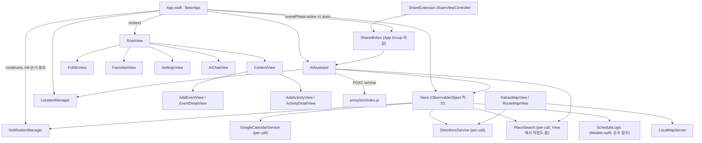
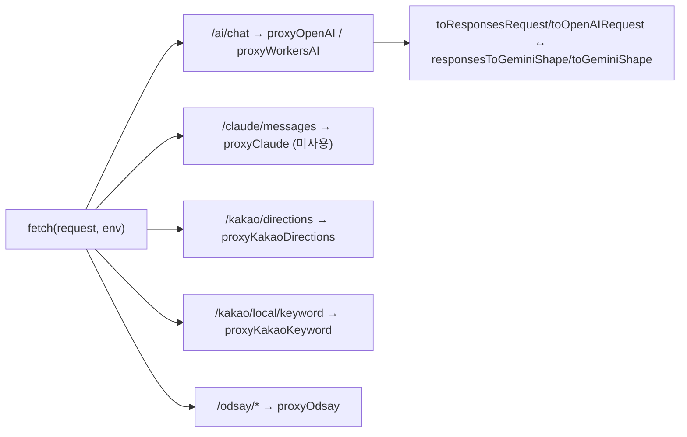

# 의존 관계 그래프

## 앱 쪽 (Swift)

## 프록시 쪽 (Cloudflare Worker)

## 주목할 결합 패턴

- **이벤트버스 없음** — `structure.md`에 명시된 관례대로 "A가 Store의 B 배열을 읽는다"는 형태로만 서비스 간 연계가 이뤄진다. `AIAssistant`·`ContentView`·`FullSirView` 전부 `Store`의 배열·메서드에 직접 접근.
- **`ActivityBlock` ↔ `ScheduledEvent` 양방향 결합** — 진짜 순환 임포트는 아니지만(둘 다 `Store` 내부), `linkedActivityId`로 연결된 두 블록을 옮기거나 지우는 메서드(`moveActivity`, `deleteActivity`, `modifyEvent`, `realignReturnLeg`)가 서로의 상태로 되돌아 들어간다 — "연결 블록" 불변식(`Store.swift:124-181`, `276-284` 주석 참고).
- **`Tools/MakeAppIcon.swift` ↔ `Theme.BesirMark`** — 컴파일러가 강제하지 않는 수동 동기화 의존성. 한쪽 기하 상수를 고치면 반드시 다른 쪽도 같이 고쳐야 한다(CLAUDE.md에도 명시).
- **구글 캘린더만 예외** — 나머지 외부 API는 전부 프록시를 거치지만, `GoogleCalendarService`는 앱에서 직접 OAuth+Keychain으로 구글 API를 호출한다.
